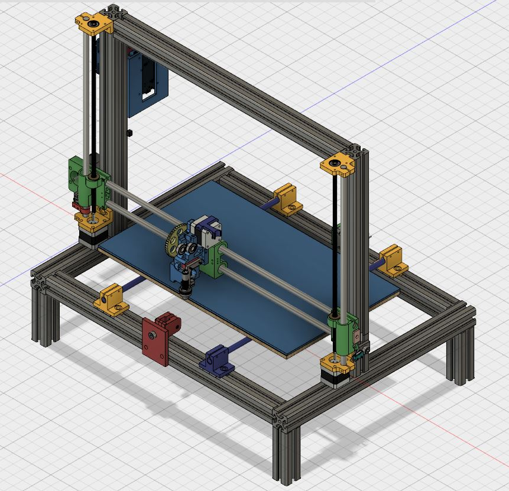

# nixal_reprap4040   

  

A scalable and robust open-hardware Reprap 3D printer based on aluminium profile 4040.  
All plastic parts and the assembly are designed in Fusion 360 CAD.  
Table dimensions: 500mm x 300mm  

